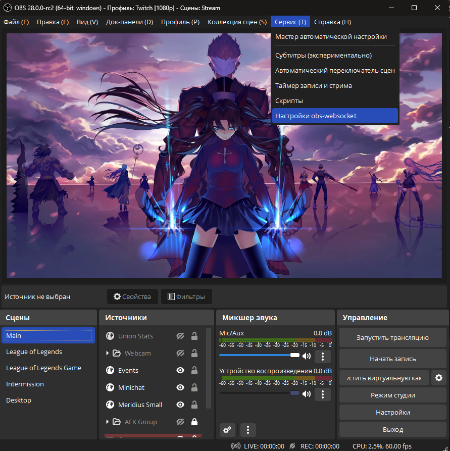

## OBS v28: гайд по миграции

OBS, начиная с версии 28 теперь включает в себя плагин obs-websocket (версии 5) по-умолчанию. Раньше для оверлея использовалась 4 версия плагина, которую необходимо было устанавливать вручную. Теперь для корректной работы плагина необходимо его перенастроить.

Оверлей версии 2.0.0 автоматически заменит конфигурацию, если обнаружит, что у вас стоят параметры подключения по умолчанию, но если нет, то вот новые параметры подключения:

```bash
Адрес по умолчанию: 127.0.0.1
Порт по умолчанию: 4455
```

> Обратите внимание, что адрес localhost теперь не равно 127.0.0.1 для плагина, поэтому подключение по адресу localhost больше не сработает.

### Что необходимо сделать для корректной работы плагина

Модуль по-прежнему имеет проблемы с подключением по паролю, поэтому его необходимо будет снять. По умолчанию после обновления, даже если у вас не стояло пароля на 4 версии плагина, новая версия сгенерирует его. Необходимо отключить аутентификацию.


1. Откройте настройки obs-websocket

2. Убедитесь, что у вас включен сервер, номер порта соответствует указанному в оверлее и отключена аутентификация.

